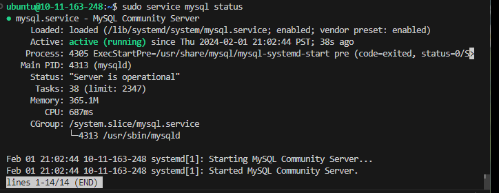

# Connect to the remote Ubuntu server
* It's easy to do remote dev with the help of vscode
``ssh user@remote.server.ip``

* To facilitate the deve convenience, copy the public ssh key from the local machine and paste it into the `authorized_keys` in the remote `.ssh` folder.

# Set up the git
* If the Ubuntu server is first into use, we need to setup the git config. Commonly, Ubuntu has pre-installed git. So we just need to configure the git user info.
``git config --global user.name "Mona Lisa"``
``git config user.email "YOUR_EMAIL"``

* Generate the ssh key and add the public key to github
``ssh-keygen -t ed25519 -C "your_email@example.com"`

* Init the local git repo
``git init``

* Push the local repo to the github
``git remote add origin https://github.com/JiaqiZhang17/webServer.git``

## Reference
* https://docs.github.com/en/get-started/getting-started-with-git/setting-your-username-in-git

# Install mysql server

* Update the package lists
``sudo apt update``

* Install the mysql server
``sudo apt install mysql-server``

* Check the mysql status
``sudo service mysql status``


* Log in to mysql
``sudo mysql -u root``

* Create a new user
``CREATE USER 'username'@'localhost' IDENTIFIED BY 'password';``

* Grant Privileges
``GRANT ALL PRIVILEGES ON database_name.* TO 'username'@'localhost';``
``GRANT ALL PRIVILEGES ON *.* TO 'webServer'@'localhost';``
``FLUSH PRIVILEGES;``

* Check the user
``SELECT user, host FROM mysql.user WHERE user = 'webServer';``

## Reference
* https://ubuntu.com/server/docs/databases-mysql

# Quick start the open-source project

* Go to the source folder and build
``sh ./build.sh``

* It shows the error of `make not found`


* It's ude to the missing `make` utility on the Ubuntu system. So we choose to install the `build-essential` package which includes `gcc`, `g++`, and `make`.
```bash
sudo apt update
sudo apt install build-essential
```
# Build error of no `mysql/mysql.h`

* After rerunning the build, it comes the new error. Cannot find the mysql dev headers `mysql/mysql.h`
```bash
ubuntu@10-11-163-248:~/TinyWebServer$ sh ./build.sh
g++ -o server  main.cpp timer/lst_timer.cpp http/http_conn.cpp log/log.cpp CGImysql/sql_connection_pool.cpp webserver.cpp config.cpp -g -lpthread -lmysqlclient
In file included from ./threadpool/threadpool.h:9,
                 from webserver.h:15,
                 from config.h:4,
                 from main.cpp:1:
./threadpool/../CGImysql/sql_connection_pool.h:6:10: fatal error: mysql/mysql.h: No such file or directory
    6 | #include <mysql/mysql.h>
      |          ^~~~~~~~~~~~~~~
compilation terminated.
In file included from timer/../http/http_conn.h:25,
                 from timer/lst_timer.cpp:2:
timer/../http/../CGImysql/sql_connection_pool.h:6:10: fatal error: mysql/mysql.h: No such file or directory
    6 | #include <mysql/mysql.h>
      |          ^~~~~~~~~~~~~~~
compilation terminated.
In file included from http/http_conn.h:25,
                 from http/http_conn.cpp:1:
http/../CGImysql/sql_connection_pool.h:6:10: fatal error: mysql/mysql.h: No such file or directory
    6 | #include <mysql/mysql.h>
      |          ^~~~~~~~~~~~~~~
compilation terminated.
In file included from log/log.cpp:5:
log/log.h: In static member function ‘static void* Log::flush_log_thread(void*)’:
log/log.h:26:5: warning: no return statement in function returning non-void [-Wreturn-type]
   26 |     }
      |     ^
In file included from log/log.cpp:5:
log/log.h: In member function ‘void* Log::async_write_log()’:
log/log.h:47:5: warning: no return statement in function returning non-void [-Wreturn-type]
   47 |     }
      |     ^
log/log.cpp: In member function ‘bool Log::init(const char*, int, int, int, int)’:
log/log.cpp:57:54: warning: ‘%s’ directive output may be truncated writing up to 127 bytes into a region of size between 92 and 247 [-Wformat-truncation=]
   57 |         snprintf(log_full_name, 255, "%s%d_%02d_%02d_%s", dir_name, my_tm.tm_year + 1900, my_tm.tm_mon + 1, my_tm.tm_mday, log_name);
      |                                                      ^~
log/log.cpp:57:17: note: ‘snprintf’ output between 9 and 291 bytes into a destination of size 255
   57 |         snprintf(log_full_name, 255, "%s%d_%02d_%02d_%s", dir_name, my_tm.tm_year + 1900, my_tm.tm_mon + 1, my_tm.tm_mday, log_name);
      |         ~~~~~~~~^~~~~~~~~~~~~~~~~~~~~~~~~~~~~~~~~~~~~~~~~~~~~~~~~~~~~~~~~~~~~~~~~~~~~~~~~~~~~~~~~~~~~~~~~~~~~~~~~~~~~~~~~~~~~~~~~~~~
log/log.cpp: In member function ‘void Log::write_log(int, const char*, ...)’:
log/log.cpp:119:41: warning: ‘%s’ directive output may be truncated writing up to 127 bytes into a region of size between 113 and 255 [-Wformat-truncation=]
  119 |             snprintf(new_log, 255, "%s%s%s.%lld", dir_name, tail, log_name, m_count / m_split_lines);
      |                                         ^~
log/log.cpp:119:21: note: ‘snprintf’ output between 3 and 291 bytes into a destination of size 255
  119 |             snprintf(new_log, 255, "%s%s%s.%lld", dir_name, tail, log_name, m_count / m_split_lines);
      |             ~~~~~~~~^~~~~~~~~~~~~~~~~~~~~~~~~~~~~~~~~~~~~~~~~~~~~~~~~~~~~~~~~~~~~~~~~~~~~~~~~~~~~~~~
log/log.cpp:113:41: warning: ‘%s’ directive output may be truncated writing up to 127 bytes into a region of size between 113 and 255 [-Wformat-truncation=]
  113 |             snprintf(new_log, 255, "%s%s%s", dir_name, tail, log_name);
      |                                         ^~
log/log.cpp:113:21: note: ‘snprintf’ output between 1 and 270 bytes into a destination of size 255
  113 |             snprintf(new_log, 255, "%s%s%s", dir_name, tail, log_name);
      |             ~~~~~~~~^~~~~~~~~~~~~~~~~~~~~~~~~~~~~~~~~~~~~~~~~~~~~~~~~~
CGImysql/sql_connection_pool.cpp:1:10: fatal error: mysql/mysql.h: No such file or directory
    1 | #include <mysql/mysql.h>
      |          ^~~~~~~~~~~~~~~
compilation terminated.
In file included from ./threadpool/threadpool.h:9,
                 from webserver.h:15,
                 from webserver.cpp:1:
./threadpool/../CGImysql/sql_connection_pool.h:6:10: fatal error: mysql/mysql.h: No such file or directory
    6 | #include <mysql/mysql.h>
      |          ^~~~~~~~~~~~~~~
compilation terminated.
In file included from ./threadpool/threadpool.h:9,
                 from webserver.h:15,
                 from config.h:4,
                 from config.cpp:1:
./threadpool/../CGImysql/sql_connection_pool.h:6:10: fatal error: mysql/mysql.h: No such file or directory
    6 | #include <mysql/mysql.h>
      |          ^~~~~~~~~~~~~~~
compilation terminated.
make: *** [makefile:12: server] Error 1
```

* Install the mysql dev library
```bash
sudo apt update
sudo apt install libmysqlclient-dev
```

* Rebuild the project
Although still warning exist, the buld process succeed
```
ubuntu@10-11-163-248:~/TinyWebServer$ sh ./build.sh
g++ -o server  main.cpp timer/lst_timer.cpp http/http_conn.cpp log/log.cpp CGImysql/sql_connection_pool.cpp webserver.cpp config.cpp -g -lpthread -lmysqlclient
In file included from ./threadpool/../CGImysql/sql_connection_pool.h:12,
                 from ./threadpool/threadpool.h:9,
                 from webserver.h:15,
                 from config.h:4,
                 from main.cpp:1:
./threadpool/../CGImysql/../log/log.h: In static member function ‘static void* Log::flush_log_thread(void*)’:
./threadpool/../CGImysql/../log/log.h:27:5: warning: no return statement in function returning non-void [-Wreturn-type]
   27 |     }
      |     ^
In file included from ./threadpool/../CGImysql/sql_connection_pool.h:12,
                 from ./threadpool/threadpool.h:9,
                 from webserver.h:15,
                 from config.h:4,
                 from main.cpp:1:
./threadpool/../CGImysql/../log/log.h: In member function ‘void* Log::async_write_log()’:
./threadpool/../CGImysql/../log/log.h:49:5: warning: no return statement in function returning non-void [-Wreturn-type]
   49 |     }
      |     ^
In file included from timer/lst_timer.h:25,
                 from timer/lst_timer.cpp:1:
timer/../log/log.h: In static member function ‘static void* Log::flush_log_thread(void*)’:
timer/../log/log.h:27:5: warning: no return statement in function returning non-void [-Wreturn-type]
   27 |     }
      |     ^
In file included from timer/lst_timer.h:25,
                 from timer/lst_timer.cpp:1:
timer/../log/log.h: In member function ‘void* Log::async_write_log()’:
timer/../log/log.h:49:5: warning: no return statement in function returning non-void [-Wreturn-type]
   49 |     }
      |     ^
In file included from http/../CGImysql/sql_connection_pool.h:12,
                 from http/http_conn.h:25,
                 from http/http_conn.cpp:1:
http/../CGImysql/../log/log.h: In static member function ‘static void* Log::flush_log_thread(void*)’:
http/../CGImysql/../log/log.h:27:5: warning: no return statement in function returning non-void [-Wreturn-type]
   27 |     }
      |     ^
In file included from http/../CGImysql/sql_connection_pool.h:12,
                 from http/http_conn.h:25,
                 from http/http_conn.cpp:1:
http/../CGImysql/../log/log.h: In member function ‘void* Log::async_write_log()’:
http/../CGImysql/../log/log.h:49:5: warning: no return statement in function returning non-void [-Wreturn-type]
   49 |     }
      |     ^
In file included from log/log.cpp:5:
log/log.h: In static member function ‘static void* Log::flush_log_thread(void*)’:
log/log.h:27:5: warning: no return statement in function returning non-void [-Wreturn-type]
   27 |     }
      |     ^
In file included from log/log.cpp:5:
log/log.h: In member function ‘void* Log::async_write_log()’:
log/log.h:49:5: warning: no return statement in function returning non-void [-Wreturn-type]
   49 |     }
      |     ^
log/log.cpp: In member function ‘bool Log::init(const char*, int, int, int, int)’:
log/log.cpp:57:54: warning: ‘%s’ directive output may be truncated writing up to 127 bytes into a region of size between 92 and 247 [-Wformat-truncation=]
   57 |         snprintf(log_full_name, 255, "%s%d_%02d_%02d_%s", dir_name, my_tm.tm_year + 1900, my_tm.tm_mon + 1, my_tm.tm_mday, log_name);
      |                                                      ^~
log/log.cpp:57:17: note: ‘snprintf’ output between 9 and 291 bytes into a destination of size 255
   57 |         snprintf(log_full_name, 255, "%s%d_%02d_%02d_%s", dir_name, my_tm.tm_year + 1900, my_tm.tm_mon + 1, my_tm.tm_mday, log_name);
      |         ~~~~~~~~^~~~~~~~~~~~~~~~~~~~~~~~~~~~~~~~~~~~~~~~~~~~~~~~~~~~~~~~~~~~~~~~~~~~~~~~~~~~~~~~~~~~~~~~~~~~~~~~~~~~~~~~~~~~~~~~~~~~
log/log.cpp: In member function ‘void Log::write_log(int, const char*, ...)’:
log/log.cpp:119:41: warning: ‘%s’ directive output may be truncated writing up to 127 bytes into a region of size between 113 and 255 [-Wformat-truncation=]
  119 |             snprintf(new_log, 255, "%s%s%s.%lld", dir_name, tail, log_name, m_count / m_split_lines);
      |                                         ^~
log/log.cpp:119:21: note: ‘snprintf’ output between 3 and 291 bytes into a destination of size 255
  119 |             snprintf(new_log, 255, "%s%s%s.%lld", dir_name, tail, log_name, m_count / m_split_lines);
      |             ~~~~~~~~^~~~~~~~~~~~~~~~~~~~~~~~~~~~~~~~~~~~~~~~~~~~~~~~~~~~~~~~~~~~~~~~~~~~~~~~~~~~~~~~
log/log.cpp:113:41: warning: ‘%s’ directive output may be truncated writing up to 127 bytes into a region of size between 113 and 255 [-Wformat-truncation=]
  113 |             snprintf(new_log, 255, "%s%s%s", dir_name, tail, log_name);
      |                                         ^~
log/log.cpp:113:21: note: ‘snprintf’ output between 1 and 270 bytes into a destination of size 255
  113 |             snprintf(new_log, 255, "%s%s%s", dir_name, tail, log_name);
      |             ~~~~~~~~^~~~~~~~~~~~~~~~~~~~~~~~~~~~~~~~~~~~~~~~~~~~~~~~~~
In file included from CGImysql/sql_connection_pool.h:12,
                 from CGImysql/sql_connection_pool.cpp:9:
CGImysql/../log/log.h: In static member function ‘static void* Log::flush_log_thread(void*)’:
CGImysql/../log/log.h:27:5: warning: no return statement in function returning non-void [-Wreturn-type]
   27 |     }
      |     ^
In file included from CGImysql/sql_connection_pool.h:12,
                 from CGImysql/sql_connection_pool.cpp:9:
CGImysql/../log/log.h: In member function ‘void* Log::async_write_log()’:
CGImysql/../log/log.h:49:5: warning: no return statement in function returning non-void [-Wreturn-type]
   49 |     }
      |     ^
In file included from ./threadpool/../CGImysql/sql_connection_pool.h:12,
                 from ./threadpool/threadpool.h:9,
                 from webserver.h:15,
                 from webserver.cpp:1:
./threadpool/../CGImysql/../log/log.h: In static member function ‘static void* Log::flush_log_thread(void*)’:
./threadpool/../CGImysql/../log/log.h:27:5: warning: no return statement in function returning non-void [-Wreturn-type]
   27 |     }
      |     ^
In file included from ./threadpool/../CGImysql/sql_connection_pool.h:12,
                 from ./threadpool/threadpool.h:9,
                 from webserver.h:15,
                 from webserver.cpp:1:
./threadpool/../CGImysql/../log/log.h: In member function ‘void* Log::async_write_log()’:
./threadpool/../CGImysql/../log/log.h:49:5: warning: no return statement in function returning non-void [-Wreturn-type]
   49 |     }
      |     ^
In file included from ./threadpool/../CGImysql/sql_connection_pool.h:12,
                 from ./threadpool/threadpool.h:9,
                 from webserver.h:15,
                 from config.h:4,
                 from config.cpp:1:
./threadpool/../CGImysql/../log/log.h: In static member function ‘static void* Log::flush_log_thread(void*)’:
./threadpool/../CGImysql/../log/log.h:27:5: warning: no return statement in function returning non-void [-Wreturn-type]
   27 |     }
      |     ^
In file included from ./threadpool/../CGImysql/sql_connection_pool.h:12,
                 from ./threadpool/threadpool.h:9,
                 from webserver.h:15,
                 from config.h:4,
                 from config.cpp:1:
./threadpool/../CGImysql/../log/log.h: In member function ‘void* Log::async_write_log()’:
./threadpool/../CGImysql/../log/log.h:49:5: warning: no return statement in function returning non-void [-Wreturn-type]
   49 |     }
      |     ^
```

* Start the server
You can check the server status by the `server_log` file.
``./server``
To access the port through the browser locally, open the `9006` port on the firewall.